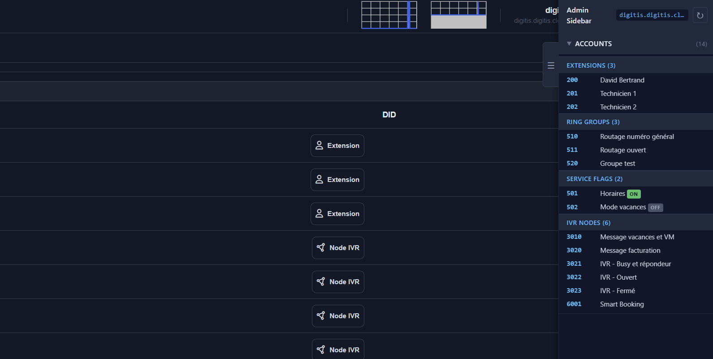
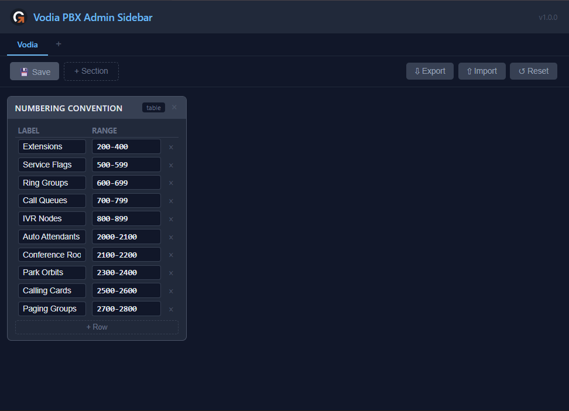
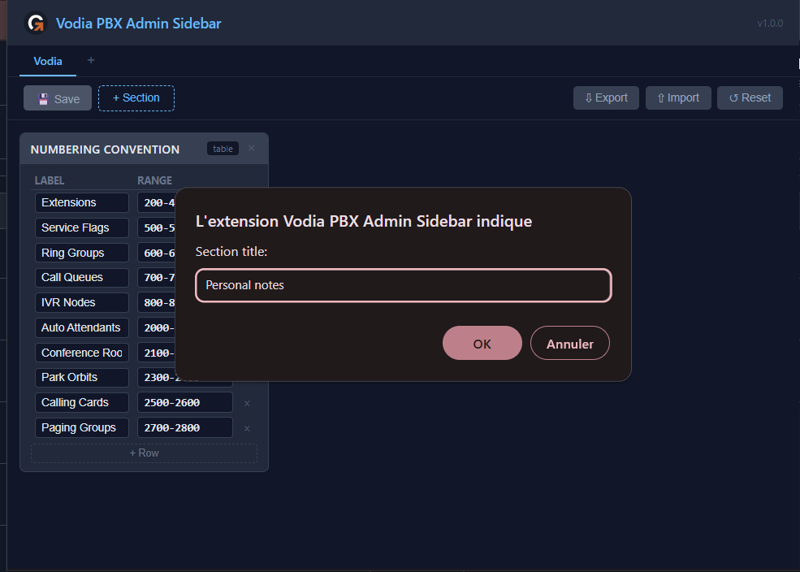
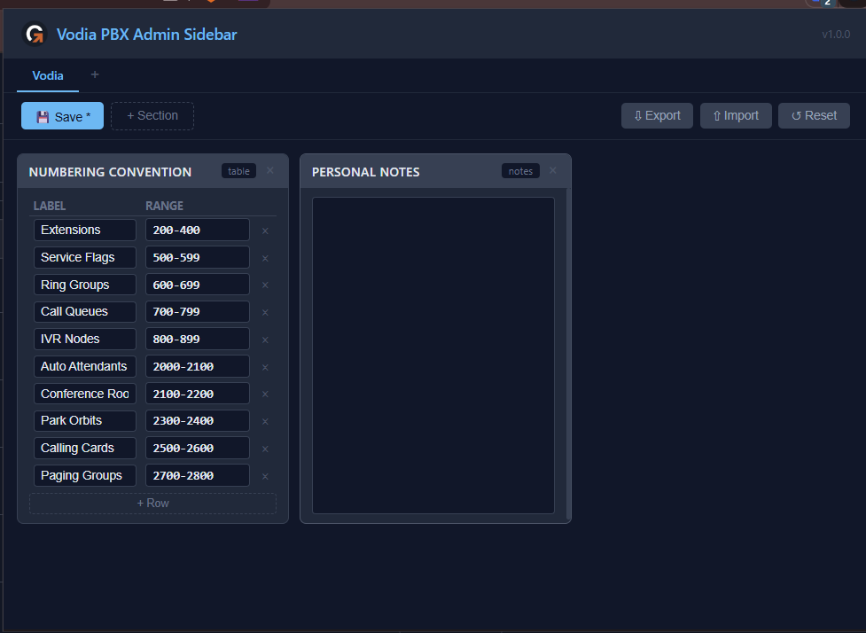

# Vodia PBX Admin Sidebar

A Chrome extension that adds a sidebar to the Vodia PBX admin interface, giving you a consolidated view of all accounts for the active tenant — something the native UI doesn't provide.

It also includes a tabbed notes system with editable numbering convention tables, drag-and-drop sections, and JSON export/import for backup.

## Features

### Admin Sidebar (on Vodia PBX)

- Automatically detects when you're on a Vodia tenant admin page
- Displays all account types in a collapsible sidebar:
  - Extensions, Auto Attendants, Conference Rooms, Ring Groups, Call Queues, Park Orbits, Calling Cards, Paging Groups, Service Flags, IVR Nodes
- Service Flags show live ON/OFF status
- Accounts sorted by number, grouped by type
- Total account count per type and overall
- Refresh button to reload data
- Collapsible toggle on the right edge



### Popup — Tabbed Notes

- 3-column grid layout with draggable section cards
- Two section types: **table** (editable columns) and **notes** (free text)
- Tabs to organize sections by context (rename, add, delete)
- Default **Numbering Convention** table included — fully editable to match your setup
- Auto-save to local storage (no data loss)







### Export / Import / Reset

- **Export**: Download all your notes as a dated JSON file (`vodia-notes-2025-03-19.json`)
- **Import**: Restore notes from a previously exported JSON file
- **Reset**: Return to the default numbering convention

## How it works

- **Zero API keys required** — the extension uses your existing Vodia admin session cookie (same-origin requests)
- **Read-only** — only GET requests to the Vodia REST API
- **No backend server** — everything runs client-side in the browser
- **Minimal permissions** — only `storage` (for saving notes locally)

## Installation

1. Download or clone this repository
2. Open `chrome://extensions/` in Chrome
3. Enable **Developer mode** (top right toggle)
4. Click **Load unpacked** and select the `package/` folder
5. Navigate to your Vodia PBX admin interface — the sidebar appears automatically

## Vodia REST API endpoints used

| Data | Endpoint |
|------|----------|
| Extensions | `GET /rest/domain/{d}/userlist/extensions` |
| Ring Groups | `GET /rest/domain/{d}/userlist/hunts` |
| Service Flags | `GET /rest/domain/{d}/userlist/srvflags` |
| IVR Nodes | `GET /rest/domain/{d}/userlist/ivrnodes` |
| Auto Attendants | `GET /rest/domain/{d}/userlist/aas` |
| Call Queues | `GET /rest/domain/{d}/userlist/acds` |
| Conference Rooms | `GET /rest/domain/{d}/userlist/confrooms` |
| Park Orbits | `GET /rest/domain/{d}/userlist/parkorbits` |
| Paging Groups | `GET /rest/domain/{d}/userlist/paginggroups` |
| Calling Cards | `GET /rest/domain/{d}/userlist/callingcards` |

## Project structure

```
package/
├── manifest.json       Manifest V3 — minimal permissions
├── content.js          Content script — sidebar injection + Vodia API
├── content.css         Sidebar styles
├── popup.html          Popup UI — tabbed notes grid
├── popup.js            Notes logic — tabs, drag-and-drop, export/import
├── convention.json     Default numbering convention (loaded on first use)
└── icons/
    ├── icon16.png
    ├── icon48.png
    └── icon128.png
```

## License

MIT
